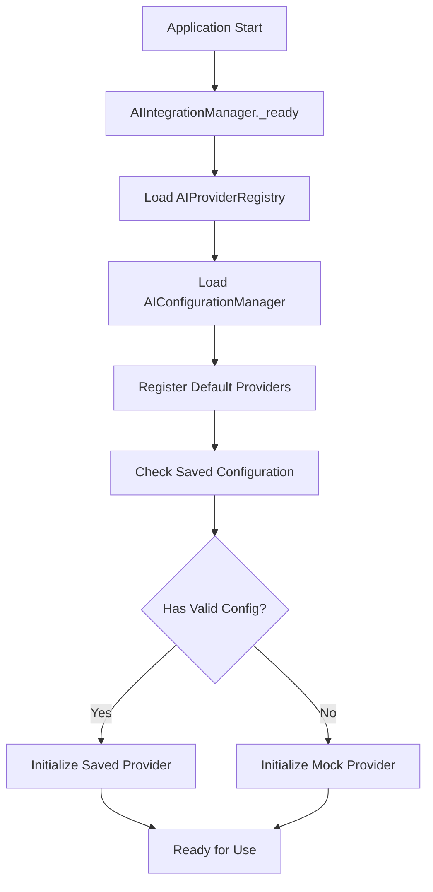
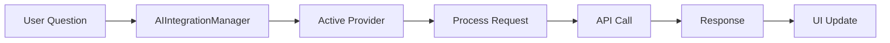

# AI Integration Flow Documentation

## Overview

The NeuroVis educational platform uses a modular AI integration system that supports multiple AI providers (currently Gemini and Mock providers). This document explains the complete flow from initialization to user interaction.

## Architecture Components

### 1. **AIIntegrationManager** (Orchestrator)
- **Location**: `core/ai/AIIntegrationManager.gd`
- **Autoload**: `AIIntegration`
- **Purpose**: Central coordinator for all AI functionality
- **Responsibilities**:
  - Initialize AI providers
  - Handle provider switching
  - Manage setup dialogs
  - Route AI requests

### 2. **AIProviderRegistry** (Provider Management)
- **Location**: `core/ai/AIProviderRegistry.gd`
- **Autoload**: `AIRegistry`
- **Purpose**: Register and manage available AI providers
- **Responsibilities**:
  - Provider registration/unregistration
  - Active provider tracking
  - Provider capability queries

### 3. **AIConfigurationManager** (Settings)
- **Location**: `core/ai/config/AIConfigurationManager.gd`
- **Autoload**: `AIConfig`
- **Purpose**: Persist AI settings and API keys
- **Responsibilities**:
  - Save/load provider configurations
  - Secure API key storage
  - Default provider management

### 4. **AI Providers** (Implementations)
- **Base Interface**: `core/ai/interfaces/AIProviderInterface.gd`
- **Implementations**:
  - `GeminiAIProvider.gd` - Google Gemini integration
  - `MockAIProvider.gd` - Testing/demo provider

## Initialization Flow



### Step-by-Step Initialization

1. **Application Start**
   ```gdscript
   # In project.godot autoloads:
   AIConfig="*res://core/ai/config/AIConfigurationManager.gd"
   AIRegistry="*res://core/ai/AIProviderRegistry.gd"
   AIIntegration="*res://core/ai/AIIntegrationManager.gd"
   ```

2. **AIIntegrationManager Initialization**
   ```gdscript
   func _ready() -> void:
       await get_tree().process_frame
       initialize()
   ```

3. **Provider Registration**
   ```gdscript
   # In AIIntegrationManager.initialize():
   _registry = get_node_or_null("/root/AIRegistry")
   _config_manager = get_node_or_null("/root/AIConfig")

   # Registry registers default providers:
   - MockAIProvider (always available)
   - GeminiAIProvider (requires API key)
   ```

4. **Configuration Check**
   ```gdscript
   # Check for saved provider preference
   var saved_provider = _config_manager.get_default_provider()
   if saved_provider and _registry.has_provider(saved_provider):
       _registry.set_active_provider(saved_provider)
   ```

## Provider Setup Flow

### First-Time Setup (Gemini Example)

1. **User triggers AI feature** (e.g., clicks AI Assistant button)

2. **AIIntegrationManager checks provider**
   ```gdscript
   func handle_setup_provider(provider_id: String) -> void:
       if provider_id == "gemini":
           _show_gemini_setup_dialog()
   ```

3. **Setup Dialog Display**
   ```gdscript
   # Load and display GeminiSetupDialog
   var dialog = load("res://core/ai/ui/setup/GeminiSetupDialog.tscn")
   dialog.setup_completed.connect(_on_setup_completed)
   dialog.setup_cancelled.connect(_on_setup_cancelled)
   ```

4. **API Key Validation**
   ```gdscript
   # User enters API key
   # Dialog validates with provider
   provider.validate_api_key(api_key)
   # Provider emits api_key_validated signal
   ```

5. **Configuration Save**
   ```gdscript
   # On successful validation
   _config_manager.save_provider_config("gemini", {
       "api_key": api_key,
       "model": selected_model
   })
   ```

## Runtime AI Request Flow



### Request Processing

1. **Structure Selection Context**
   ```gdscript
   # When user selects a brain structure
   func _on_structure_selected(structure_name: String):
       ai_integration.set_current_structure(structure_name)
   ```

2. **Question Submission**
   ```gdscript
   # User asks question through UI
   ai_integration.ask_question("What does the hippocampus do?")
   ```

3. **Provider Routing**
   ```gdscript
   # AIIntegrationManager routes to active provider
   var provider = _registry.get_active_provider()
   if provider:
       provider.ask_question(question)
   ```

4. **Response Handling**
   ```gdscript
   # Provider processes and emits response
   signal response_received(response: String)

   # UI updates with response
   func _on_ai_response_received(question: String, response: String):
       info_panel.display_ai_response(response)
   ```

## Provider Interface Requirements

All AI providers must implement `AIProviderInterface`:

```gdscript
class_name AIProviderInterface
extends Node

# Required signals
signal response_received(response: String)
signal error_occurred(error: String)
signal api_key_validated(is_valid: bool, message: String)

# Required methods
func initialize() -> bool
func setup_api_key(key: String) -> bool
func ask_question(question: String) -> String
func check_setup_status() -> bool
func needs_setup() -> bool
func validate_api_key(key: String) -> void
func get_service_status() -> Dictionary
```

## Error Handling

### Common Error Scenarios

1. **No Provider Available**
   ```gdscript
   if not _registry.get_active_provider():
       push_error("[AIIntegration] No AI provider available")
       return
   ```

2. **Provider Not Initialized**
   ```gdscript
   if provider.needs_setup():
       handle_setup_provider(provider_id)
       return
   ```

3. **API Request Failure**
   ```gdscript
   # Providers emit error signal
   signal error_occurred(error: String)

   # Manager handles and displays error
   func _on_provider_error(error: String):
       show_error_notification(error)
   ```

## Adding New AI Providers

### Step 1: Create Provider Class

```gdscript
# core/ai/providers/NewAIProvider.gd
class_name NewAIProvider
extends AIProviderInterface

func initialize() -> bool:
    # Provider-specific initialization
    return true

func ask_question(question: String) -> String:
    # Implement API call logic
    # Emit response_received signal
    return ""
```

### Step 2: Register Provider

```gdscript
# In AIProviderRegistry._register_default_providers():
var new_provider = preload("res://core/ai/providers/NewAIProvider.gd").new()
register_provider("new_provider", new_provider, {
    "name": "New AI Provider",
    "requires_key": true,
    "models": ["model-1", "model-2"]
})
```

### Step 3: Add Setup UI (if needed)

Create setup dialog similar to `GeminiSetupDialog.tscn` for API key configuration.

## Best Practices

1. **Always check provider availability** before making requests
2. **Handle errors gracefully** with user-friendly messages
3. **Save API keys securely** using ConfigFile encryption
4. **Provide fallback** to MockAIProvider for offline testing
5. **Emit proper signals** for UI updates
6. **Validate API keys** before saving
7. **Clean up resources** when switching providers

## Testing

### Unit Testing
```gdscript
# Test provider registration
func test_provider_registration():
    var registry = AIProviderRegistry.new()
    var mock_provider = MockAIProvider.new()

    registry.register_provider("test", mock_provider, {})
    assert(registry.has_provider("test"))
```

### Integration Testing
```gdscript
# Test full flow
func test_ai_question_flow():
    var integration = AIIntegrationManager.new()
    integration.initialize()

    integration.set_current_structure("hippocampus")
    integration.ask_question("What is this structure?")

    # Verify response received
```

## Debugging

Enable debug output:
```gdscript
# In AIIntegrationManager
var debug_mode = true

# Check provider status
ai_integration.get_provider_status()

# List available providers
ai_integration.get_available_providers()
```

## Security Considerations

1. **API Keys**: Never commit API keys to version control
2. **Encryption**: Use ConfigFile's built-in encryption for sensitive data
3. **Validation**: Always validate API keys before use
4. **Rate Limiting**: Implement rate limiting to prevent API abuse
5. **Error Messages**: Don't expose sensitive information in error messages

## Future Enhancements

- Support for additional AI providers (OpenAI, Claude API)
- Streaming responses for long answers
- Context management for conversation history
- Multi-language support
- Offline fallback with cached responses
- Voice input/output integration
